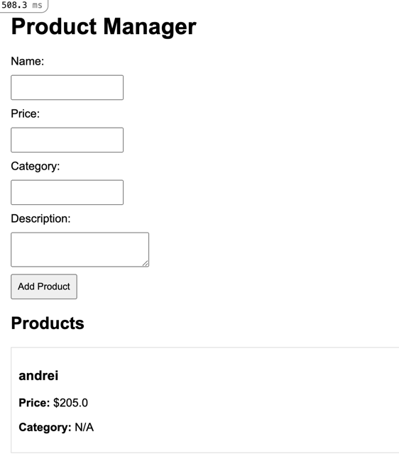

## API Документация: Менеджер товаров

## Необходимые зависимости:
1. Ruby: Версия 2.7 или выше.
2. Rails: Версия 6.0 или выше.
3. SQLite3: Для работы с базой данных (или другой настроенный адаптер).
4. Node.js: Для управления JavaScript (например, для работы с фронтендом).
5. Yarn: Пакетный менеджер для JavaScript (можно заменить npm, если установлен).
6. Git: Для работы с репозиториями (опционально, если проект в git).

## Endpoints
1. **GET /products**
    - Описание: Получить список всех товаров.
    - Ответ: JSON массив объектов товара.

2. **POST /products**
    - Описание: Создать новый товар.
    - Параметры:
        - `name` (string, обязательный)
        - `price` (decimal, обязательный)
        - `category` (string, необязательный)
        - `description` (text, необязательный)
    - Ответ: JSON объект созданного товара.

3. **GET /products/:id**
    - Описание: Получить данные конкретного товара.
    - Ответ: JSON объект товара.

4. **PUT /products/:id**
    - Описание: Обновить данные товара.
    - Параметры: Те же, что и для POST.
    - Ответ: JSON объект обновленного товара.

5. **DELETE /products/:id**
    - Описание: Удалить товар.
    - Ответ: HTTP статус 204 (No Content).

## Валидации
- Поля `name` и `price` обязательны.
- Поле `price` должно быть числом >= 0.

# Шаги для установки и запуска
1. - git clone https://github.com/ваш-проект.git
   - cd ваш-проект
2. gem install rails
3. bundle install
4. yarn install
5. - rails db:create
   - rails db:migrate
6. rails server: По умолчанию сервер будет доступен по адресу http://localhost:3000.

# Цель проекта:
Цель проекта
Цель проекта — разработать простое и удобное приложение для управления товарами в магазине. Приложение предоставляет пользователям возможность добавлять, редактировать, просматривать и удалять товары через веб-интерфейс или REST API. Это решение может быть полезным для малого бизнеса, который хочет организовать и контролировать свой ассортимент.
Это приложение предоставляет базовые функции управления товарами и может быть доработано для более сложных сценариев.

# Среда выполнения:
Ruby

Версия: 2.7 или выше.
Rails

Версия: ~> 6.0.
SQLite3

Версия: >= 1.4.
Node.js и Yarn

Node.js: Версия >= 12.0.
Yarn: Версия >= 1.22.

# Заключение
Разработанное приложение "Менеджер товаров" демонстрирует базовые возможности веб-разработки с использованием фреймворка Ruby on Rails. Оно предоставляет простой и интуитивно понятный интерфейс для управления товарами, а также поддерживает REST API для интеграции с другими системами.

Проект может служить отличным стартом для изучения Rails, а также основой для дальнейшего развития и масштабирования. В его текущей версии реализованы базовые CRUD-операции, которые можно расширить, добавив функции, такие как фильтрация, сортировка, интеграция с системами авторизации или управление складскими запасами.
